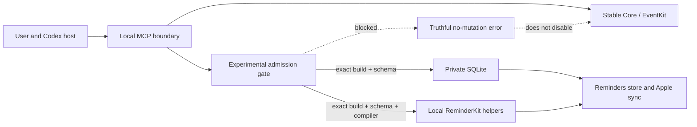

# Experimental Internals threat model

## 1. Overview

Apple Reminders for Codex is a local macOS MCP plugin. Stable Core uses the
documented EventKit surface through a reviewed bundled helper. Experimental
Internals add private SQLite and ReminderKit behavior for sections, tags,
native URL/image attachments, and Recently Deleted. The MCP routes these
families lazily, so a private failure does not initialize or disable Core
(`plugins/apple-reminders/mcp/server.py:966-1060`).

| Component | Role | Source evidence |
| --- | --- | --- |
| MCP server and Facades | Validate the closed 15-tool interface, isolate Core/Native/Recovery/Diagnostics, and validate results | `plugins/apple-reminders/mcp/server.py:966-1085` |
| Stable Core | Documented EventKit reads and writes through the bundled helper | `docs/architecture.md:69-82` |
| Experimental gate | Bind a private operation to exact build, selected compiler, and command schema evidence before dispatch | `plugins/apple-reminders/scripts/experimental_capabilities.py:139-205`; `plugins/apple-reminders/scripts/experimental_capabilities.py:238-280`; `plugins/apple-reminders/scripts/reminders_adapter.py:539-641` |
| Private SQLite adapter | Tag and URL mutations plus schema/read-back support for private workflows | `plugins/apple-reminders/scripts/reminders_adapter.py:499-536`; `plugins/apple-reminders/scripts/reminders_adapter.py:3430-3720`; `plugins/apple-reminders/scripts/reminders_adapter.py:5193-5438` |
| ReminderKit helpers | Locally compiled section, image, and recovery operations | `plugins/apple-reminders/scripts/reminders_adapter.py:1781-1970` |
| Doctor | Content-free build, schema, toolchain, and support-tier diagnosis | `plugins/apple-reminders/scripts/reminders_doctor.py:328-420`; `plugins/apple-reminders/scripts/reminders_doctor.py:1127-1213` |

### Effective resources

| Deployment or workflow | Resource or capability | Configuration and precedence | Safe effective value or location | Readers, writers, or recipients | Enforcing control | Evidence or unknowns |
| --- | --- | --- | --- | --- | --- | --- |
| Packaged Stable Core | EventKit helper | Installed plugin manifest and fixed backend paths | Bundled signed helper app | EventKit/TCC and requested account/list | Bundle/provenance checks; no automatic source fallback | `plugins/apple-reminders/scripts/eventkit_bridge.py:1728-1853` |
| Tag and native URL mutation | Reminders SQLite | Public MCP omits `--db`; adapter selects a store under the Reminders Stores root | One current-user Reminders store | Exact Reminder rows, CloudKit state, Apple sync | Exact path confinement, build allowlist, schema fingerprint, revision, transaction, read-back | Tag has no initial exact fingerprint evidence and remains disabled; URL has one admitted build. |
| Section mutation | `remkit_sections` | Fixed installed source; cache helper built locally | Per-user cache executable and lock | ReminderKit, exact list/section, Apple sync | Build allowlist before store open, compiler, schema, exact identity, helper/read-back controls | No initial section fingerprint evidence; disabled. |
| Image mutation | `remkit_attach_image` and bounded source bytes | Fixed source plus exact absolute PNG/JPEG input | Per-user cache helper and private snapshot | ReminderKit, exact Reminder attachment, Apple sync | Exact build/schema, compiler, file bounds/hash, native/content read-back | Admitted only for the recorded build; device convergence remains unproven. |
| Recently Deleted list | Read-only SQLite inventory | Exact admitted recovery schema | Selected store, bounded snapshot | Codex receives bounded metadata only | Build/schema gate, read-only connection, retention/page bounds | No recovery authority is issued by list mode (`plugins/apple-reminders/scripts/reminders_adapter.py:2973-3082`). |
| Exact recovery | `remkit_recover`, `del1`, destination list | One exact item read then one-use capability | In-memory reference plus cached helper | Same-account ReminderKit save and final EventKit read | Build/schema/compiler gate, store/version/time/digest guards, no blind retry | `plugins/apple-reminders/scripts/reminders_adapter.py:3084-3370` |

## 2. Threat model, trust boundaries, and assumptions

### Protected assets and objectives

- Preserve exact Reminder/list/account/section/tag/attachment identity and avoid
  unintended synced mutations.
- Keep private store integrity and attachment bytes intact.
- Preserve truthful mutation state: only a proven pre-dispatch failure may be
  `failed_no_mutation`; post-dispatch uncertainty stays pending or manual.
- Keep opaque `rev1` and `del1` capabilities scoped, fresh, and one-use.
- Keep Stable Core available when any private build, schema, compiler, helper,
  or framework is missing.
- Never let reminder content, URLs, or attachment metadata grant new authority
  or justify remote loading (`SECURITY.md:13-19`).

### Actors and starting capabilities

- The user/Codex caller can invoke public tools and supply schema-valid IDs,
  references, URLs, and local image paths. It cannot select an arbitrary private
  backend or SQLite path through the public MCP.
- Synced/shared Reminder data can contain untrusted titles, notes, labels,
  attachment metadata, and links. It has no tool authority.
- Concurrent Reminders/iCloud activity can change public revisions, private
  `Z_OPT`, membership, attachment identity, and deleted-item guards.
- An unknown macOS/Reminders build is a deployment condition. Impact additionally
  requires changed private semantics that pass structural probes; this model
  does not claim such a vulnerability has been observed.
- The attacker is not assumed to already control the local user, installed
  plugin bytes, Apple account, code-signing credentials, or TCC configuration.

### Trust boundaries and invariants

1. **Caller → MCP:** closed schemas and exact references must prevent a display
   name or untrusted field from becoming mutation authority.
2. **MCP → Core:** EventKit must remain independent of the private admission
   module. A missing private capability cannot trigger a fallback.
3. **MCP → Experimental adapter:** every private command must map to a fixed
   capability specification (`plugins/apple-reminders/scripts/experimental_capabilities.py:139-173`).
4. **Runtime metadata → admission:** all four exact version/build values must be
   present and match reviewed evidence (`plugins/apple-reminders/scripts/experimental_capabilities.py:283-322`).
5. **Admission → store/helper:** unsupported build and missing compiler failures
   occur before store resolution; schema inspection is read-only and precedes
   dispatch (`plugins/apple-reminders/scripts/reminders_adapter.py:577-641`).
6. **Private write → receipt:** existing operation-specific exact guards,
   transactions, helper provenance markers, and read-back remain mandatory after
   admission. The allowlist is necessary, not sufficient.
7. **Result → retry:** partial or unknown native failure must never be translated
   to success or automatically retried.

### Assumptions and exclusions

- This model is source-backed and synthetic. It did not open a real Reminders
  store, change TCC, load a private framework, compile/run a private helper, or
  inspect personal data.
- The initial evidence is limited to macOS 26.5.2 build 25F84 and Reminders 7.0
  build 3976. It is not a minimum-version range or a claim about future builds.
- Static tests prove gate ordering and error semantics, not iCloud convergence,
  shared-list delivery, Intel hardware behavior, or iPhone visibility.
- Core URL create/change is intentionally hybrid: EventKit metadata can commit
  before the private native URL step reports a blocked/partial result. Callers
  needing a Core-only link should use notes until a separate Core-only URL mode
  exists.
- Same-user replacement of installed or cached executable bytes is an integrity
  concern but does not by itself add authority beyond the already compromised
  local user.

## 3. Attack surface, mitigations, and attacker stories

These are prioritized hypotheses and failure stories, not validated
vulnerabilities.

| Priority | Scenario and capability gain | Prerequisites | Impact | Existing controls | Mitigation | Evidence |
| --- | --- | --- | --- | --- | --- | --- |
| High | A new OS keeps familiar tables/selectors but changes semantics; a private write corrupts or misroutes synced state. | Authorized private mutation on an unreviewed build plus semantic drift. | Wrong Reminder, attachment, section, tag, or recovery state; possible sync spread. | Exact references, schema fields, revisions, read-back. | Positive exact build + fingerprint admission; unknown builds fail before store/helper dispatch. | `plugins/apple-reminders/scripts/experimental_capabilities.py:354-443`; `plugins/apple-reminders/scripts/reminders_adapter.py:577-641` |
| High | A helper times out/crashes after save and the caller retries as though nothing happened. | Post-dispatch failure and optimistic error mapping. | Duplicate or destructive second mutation. | Typed transport certainty, pending/manual receipts, reference consumption, durable fence. | Preserve existing conservative state; never fallback or auto-retry. | `plugins/apple-reminders/mcp/v2_transport.py:1-41`; `plugins/apple-reminders/mcp/v2_native.py:910-1042` |
| High | Recovery guard points to changed store/item/destination but helper still saves. | Concurrent deletion/recovery/list change. | Restore wrong or changed object; lose attachment integrity. | Store/version/deletion/attachment/native guards, same-account check, final EventKit read. | Gate build first and keep every guard immediately before save. | `plugins/apple-reminders/scripts/reminders_adapter.py:3144-3370` |
| Medium | A helper-backed path proceeds without its selected toolchain or trusts a PATH shim, then silently falls back. | Missing CLT, attacker-controlled PATH, or fallback logic. | Installer UI, unsupported write, or execution of an untrusted compiler. | Fixed command routing; helper launch errors are conservative. | Fixed `/usr/bin/xcode-select -p`, fixed selected-directory compiler path, environment-override rejection, `compiler_required` before store resolution, and no fallback. | `plugins/apple-reminders/scripts/experimental_capabilities.py:238-280`; `plugins/apple-reminders/scripts/reminders_adapter.py:577-690` |
| Medium | Section/tag capability is inferred from the observed build even though exact command-schema evidence is missing. | Maintainer or runtime treats structural similarity as approval. | Unvalidated Experimental mutation. | None sufficient before this decision. | Empty allowlist is an explicit kill switch. | `plugins/apple-reminders/scripts/experimental_capabilities.py:193-205` |
| Medium | Untrusted reminder text or URL persuades the agent to widen scope or fetch a resource. | Malicious synced/shared content plus agent action. | Additional local/network action beyond user intent. | Security policy, bounded selectors, no implicit URL fetch. | Keep data non-authoritative; use notes as data only. | `SECURITY.md:13-19` |
| Low | Diagnostic output falsely calls a private path Stable or available. | Projection drops runtime/build/toolchain state. | User retries unsupported work. | Content-free Doctor and closed public error codes. | Project support tier, compiler requirement, build/schema compatibility, and precise reason. | `plugins/apple-reminders/mcp/v2_diagnostics.py:13-75`; `plugins/apple-reminders/scripts/reminders_doctor.py:1127-1213` |

## 4. Severity calibration

- **Critical:** A remotely reachable path that crosses the local-user/TCC or
  code-signing boundary without user authority, or arbitrary code execution in
  the trusted helper context. No such path is established here.
- **High:** An authorized but exact-target-bounded request on an unknown build
  causes a materially different private mutation, destructive recovery, or
  repeated post-dispatch write that can sync. This needs concrete semantic drift
  or contradictory write evidence; build novelty alone is not a finding.
- **Medium:** A private capability bypasses positive admission but remains
  constrained to the requesting local user's exact authorized item, or diagnosis
  encourages an unsafe retry. Exact preconditions and read-back lower severity
  but do not make the compatibility gap acceptable.
- **Low:** Misclassification, confusing dependency guidance, or content-free
  metadata leakage with no new write authority. A clear blocked result and Core
  alternative usually keep this low.

Passing compilation, schema-field, selector, Gatekeeper, or notarization checks
does not reduce an unknown build to supported. Conversely, a blocked capability
with no reachable mutation is a control outcome, not a vulnerability. Confidence
in the static gate is high; real private API semantics and cross-device behavior
remain explicitly unverified.
